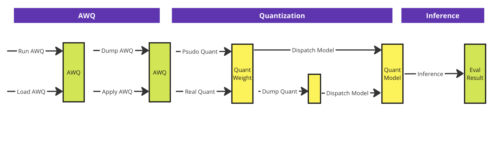
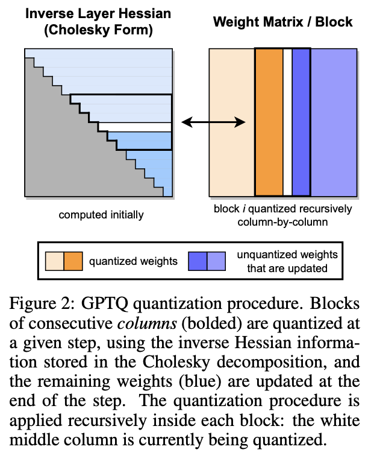

# RL-AWQ: RL-based Activation-aware Weight Quantization for LLM Compression and Acceleration 

The main phases performed in AWQ quantization method is as follows:

The above architecture mainly consists of three phases:
- First create the required AWQ for the following quantization. This step can be performed on-the-fly or by loading the previous computed AWQ
- The scond step, involves calculating the quantization parameters for the weights and activations. This step has two main approachs: 1: Using a psudo quantization method which just quantize the wieghts and activations without considering a new model architecture. 2: Using a real quantization method which considers a new model architecture (i.e., WQLinear) besides the wights and activations quantization.
- The final step is to load the quntized model by dispatching the quantized weights and architectures (in real qunatization scenrario) by calling the ModelDispatch method. Subsequently, we can utlize LM evaluators such as LM_eval to evaluate the model on a specifiec specterum of tasks.

The main technical contributins reside in:
- Considering the fact that, given weight quantization task, not all weights matter the same. Some weights (i.e., salient weights) are more important than others. Therefore, we can first find these important weights and keep them while quantizing others.
- However such approach have mized-precision weights- the salient weights in FP16 and others in INT3 which is clearly not hardware friendly. To solve this technical issue, we can first scale the weights by a learnable value s and then quantize the weights. Such s will be found in a greedy search problem formulation in a way that the difference between quantized salienrt weights and the initial salient weights min9imize while the prepelixity of the LM stay the same.

The main quantization method they used is a zero-based Round to Nearest (RTN).

Given such apprach, one can formulate the first task of finding the salient weights as a binary classififcation as each weight should be considered as salient or not. In AWQ the autors consider that to find salient weights we should consider activation distribution since weight channels corresponding to larger activation magnitudes are more salient since they process more important features.

### Related Works:

Given the post-Training Quantization (PTQ) methods, we should consider the OBQ and the efficient upgrade of it GPTQ. So basically the OBQ main idea is:
- Given the weight matrix W, given each row, we can first quantize the first weight (i.e., first column), then calculate the quantization error which is | Wx - W'x|. Here W' is the new weights with one quuantized weight and other the same as before. Then, we reconstruct the remaining not-quantized weights in the row to minimize the overall quantization error given the new first weight quantization. Then we repeate this psudo code for the remaining weights in a row until we hit the last weight. Since in this setup we can consider each row separatly, it's clear the parallisim on GPU would be beneficiary.
- Give the wight-by-weight quantization besides reconstruction of remaining weights to minimize the quantization error, authours in GPTQ came up with this idea to consider each column instead of each wight. Here, the input to each column will be the same as X (a calibration dataset will be fed to the network as X) and the order in which the quantization will be calculated remain the same for different rows unlike the OBQ approach. Besides, they provide some optimization to run this psudo approach on GPU efficiently.

